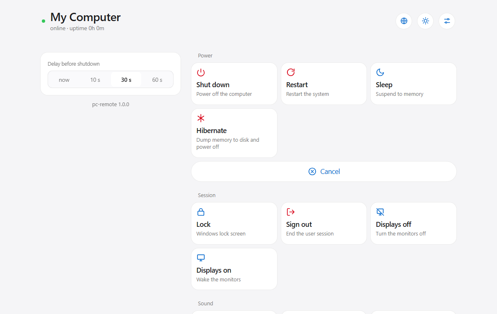
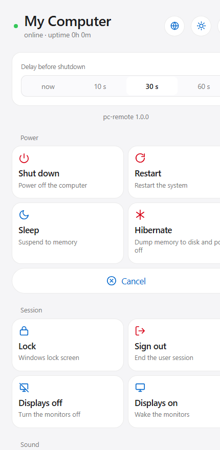
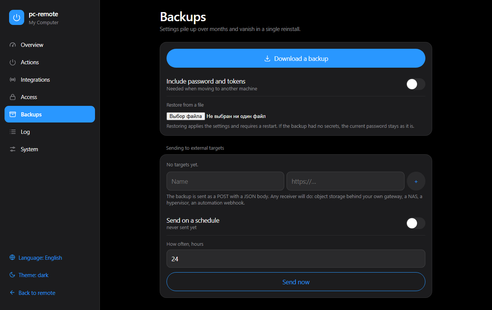

# pc-remote

Shut down, restart, sleep, lock or mute your Windows PC from your phone —
with a countdown you can still call off. Runs on the PC itself, serves a web
remote on port 5000, and announces itself to your smart home over MQTT.

<p align="center">
  
</p>

<p align="center">
  
  
</p>

---

## What it does

**Remote** — power, session, sound and app actions; the set is configurable.
A shutdown turns the top of the screen into a countdown with a full-width
cancel button. Dangerous actions confirm inside the button itself. Installs to
the home screen as an app. English and Russian, light and dark.

**Settings** — enable or disable any action, add your own launch buttons, issue
tokens for integrations, restrict access by network, back settings up, read the
log, manage autostart. All in the browser, no config files to edit.

**Integrations** — a frozen HTTP API, and MQTT with auto-discovery so your
smart home creates a device with every button and sensor by itself.

**Tray icon** — the remote is a background service; the icon is how you know
it is alive. Right-click gives the same actions without reaching for a phone.

---

## Install

### From a build — nothing to install

Unpack the folder and run once:

```
pc-remote.exe --install
```

That registers autostart and starts the remote. Python and every library are
inside the build, which removes an entire class of failures: a second Python
appearing on the machine and quietly becoming the default.

```
pc-remote.exe              run
pc-remote.exe --install    autostart + start
pc-remote.exe --uninstall  remove autostart
pc-remote.exe --status     print status and exit
```

### From source

```powershell
powershell -ExecutionPolicy Bypass -File install.ps1
```

Requires Python 3.10+. Installs dependencies, registers autostart, starts the
remote and checks that it answers. For debugging with a visible console, use
`run.bat`.

### Build it yourself

```powershell
powershell -ExecutionPolicy Bypass -File build.ps1
```

Runs the tests first and refuses to build if they fail.

**Open `/admin` and change the password first thing** — the default is
`changeme`.

---

## Why silent startup failures shaped this project

Windows opens `.pyw` through `pyw.exe`, which picks the *default* Python. If a
second Python shows up, the default can change while the dependencies stay with
the old one. And `pythonw` runs without a console, so a failed import looks like
this: nothing happened, no error anywhere, the remote just did not come up.
That takes days to notice.

Hence two rules:

1. **The autostart task stores the full path to the interpreter**, captured
   from `sys.executable` at install time — not "whatever python resolves to
   today". `run.pyw` carries a `#!python3` shebang as a second layer.
2. **Everything goes to the log.** `data/server.log` is the only source of
   truth, because stdout and stderr do not exist under `pythonw`. If even
   logging fails to start, the entry point drops a `data/CRASH.txt` next to it.

If you keep several Python installations, set `PC_REMOTE_PYTHON` before running
`install.ps1` to pin the one you want.

The same reasoning keeps the dependency list at two required packages.

---

## Adding an action

One entry in `CATALOG` in [app/actions.py](app/actions.py):

```python
Action("obs", "app", "apps",
       _wrap(lambda: _start(r"C:\Program Files\obs-studio\bin\64bit\obs64.exe"),
             "res.launching")),
```

The remote, the settings page, the API and smart-home discovery all build
themselves from that list. Add the label to [app/i18n.py](app/i18n.py) and,
if the icon is new, a `<symbol>` to
[app/templates/_icons.html](app/templates/_icons.html).

A one-off program needs no code at all — add it in Settings → Actions →
custom launch buttons.

---

## API

`POST /api`, JSON body (form and query are accepted too):

```json
{"password": "…", "action": "shutdown", "delay": 30}
```

| Field | Values |
|---|---|
| `action` | see `GET /actions` |
| `delay` | 0–600 seconds. **Absent means 30** |
| `password` | the password, or an integration token |

A token can also travel as `Authorization: Bearer <token>` instead.

Responses: `200 {"result", "pending_left"}`, `403` wrong secret or disabled
action, `400` unknown command, `500` system error, `429` locked out.

`GET /healthz` needs no password and is meant for monitoring.
`GET /actions` returns the catalog. Both accept `?lang=en|ru`.

### The contract is frozen

The `/api` path, the `password` field, the `shutdown` / `reboot` / `cancel`
actions, the status codes and the "no `delay` means 30 seconds" rule do not
change: integrations depend on them, and they break silently. Those three
actions are marked `locked` and cannot be disabled from the settings.

---

## Smart home

**HTTP** carries commands and needs nothing but the network.

**MQTT with auto-discovery** carries state. Polling over HTTP is what you write
in a hurry; with MQTT the device announces itself instead:

- discovery messages create a ready device with every button and sensor, so
  there is nothing to declare by hand;
- state is pushed the moment it changes — the countdown ticks every second
  without a single poll;
- a last will tells your smart home the PC is gone the instant it dies.

That is how Tasmota, ESPHome and Zigbee2MQTT work. Topics live under
`pc-remote/<name>/`, discovery under `homeassistant/`. Disable an action in the
settings and its button disappears from the smart home too.

Both channels can run at once: commands over HTTP, which does not depend on
the broker, and state from MQTT.

A step-by-step guide is in [docs/home-assistant.md](docs/home-assistant.md).

---

## Security

- Only the networks on the allow-list get in; by default the private ranges.
  Everything else is refused, even if the port gets exposed by accident.
- Repeated wrong passwords from one address trigger a lockout.
- Secrets are compared in constant time, with a pause on failure.
- The password can stay off disk entirely: `REMOTE_WIN11_PASSWORD` wins over
  the settings file.
- Give integrations **tokens**, not your password. Then changing the password
  breaks nothing, and a leaked token is revoked on its own.

**Custom launch buttons run arbitrary programs** for whoever knows the
password. There are none by default. Set a strong password before adding any.

HTTPS is deliberately absent: from outside the house this usually runs over a
VPN where traffic is already encrypted, and a self-signed certificate would buy
nothing but a red padlock. Put a reverse proxy in front if you need it.

---

## Tests

```powershell
python -m unittest discover -s tests -v
```

**The tests never execute system commands.** The border with Windows —
`run_cmd`, `run_detached` and the direct WinAPI calls — is stubbed out, so a
test verifies that an action builds the right command line while the machine
does nothing at all. No live server either: the HTTP layer goes through Flask's
test client and settings live in a temporary directory.

One of the tests reads every visible string out of the markup the way the page
walker sees it and checks it against the dictionary — an untranslated string
breaks nothing, which is exactly why it is easy to miss.

---

## Documentation

| | |
|---|---|
| [docs/design.md](docs/design.md) | the visual language and why it is that way |
| [docs/home-assistant.md](docs/home-assistant.md) | connecting to a smart home, from scratch |
| [CLAUDE.md](CLAUDE.md) | the traps worth knowing before changing anything |

### Translations

The interface ships in English and Russian and switches from a button in the
header, following the browser language until someone chooses otherwise.

Source strings are the keys, not invented identifiers: markup stays readable,
and a string with no translation yet simply stays English instead of turning
into `admin.backup.hint.2` in plain view. Interface strings live in
[app/static/i18n.js](app/static/i18n.js), everything the server sends —
action labels, replies, errors — in [app/i18n.py](app/i18n.py), picked per
request so a phone and a desktop can differ.

A test reads every visible string out of the markup the way the page walker
sees it and fails if any of them is missing from the dictionary.

---

## Limitations

- Actions run as a regular user. Anything needing administrator rights will not
  work — a deliberate trade in favour of not running the whole thing elevated.
- `delay: 0` adds `/f`: applications close without asking and unsaved work is
  lost. With `delay > 0` Windows adds `/f` on its own anyway.
- The remote cannot turn the computer **on** — it lives on it. Wake-on-LAN from
  a router or a smart home does that.
- Windows only. Power commands, the tray icon and autostart are built on its
  system calls.

## License

[MIT](LICENSE)
